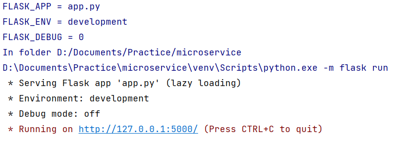
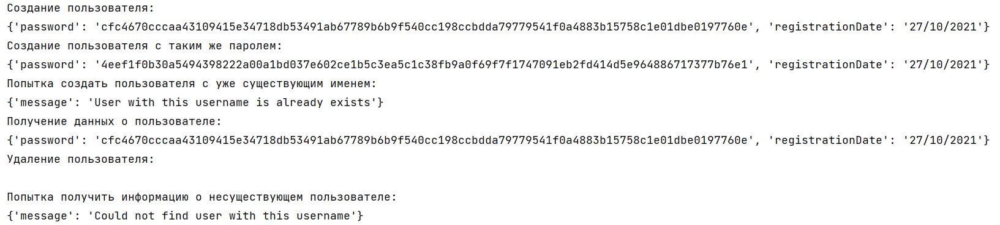

## Создание микросервиса

### Цель работы

Познакомиться с механизмом работы современных веб-приложений и микросервисной архитектуры в процессе выполнения творческого задания.

### Задания для выполнения

1. На основе предложенного шаблона реализуйте сервис, реализующий регистрацию пользователей. Сервис должен поддерживать REST API и коллекцию /user/, хранящую данные о логинах и паролях пользователей, зарегистрированных в системе. Сервис должен принимать и отдавать информацию в формате JSON. Сервис должен хранить следующую информацию про каждого пользователя: логин, хеш пароля (лучше с солью), дату регистрации.  

Для тестирования использую пакет requests, делая различные запросы. При хэшировании пароля в начало поля password добавляется соль, чтобы при в будущем при реализации авторизации пользователя ее можно было легко получить. При попытке создать двух разных пользователей с одинаковым паролем, результат получается разный благодаря добавлению соли. При удалении пользователя сервер не возвращает ничего, поэтому строка ответа сервера пустая. При попытке создать пользователя с уже существующим именем или при попытке получить информацию о несуществующем пользователе сервер отдает сообщение с ошибкой.

2. Настройте веб-сервер по Вашему выбору (Apache2 или nginx) таким образом, чтобы он поддерживал соединение по протоколу HTTPS. Для этого сгенирируйте самоподписанный сертификат SSL.
3. Модифицируйте код вашего сервиса таким образом, чтобы он поддерживал защищенное соединение.
